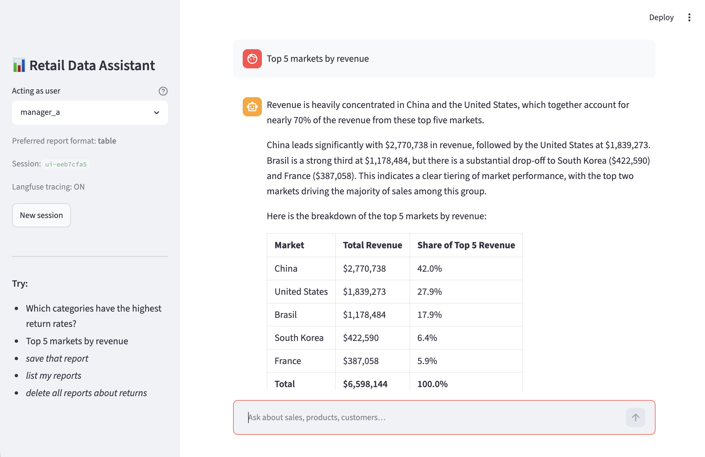
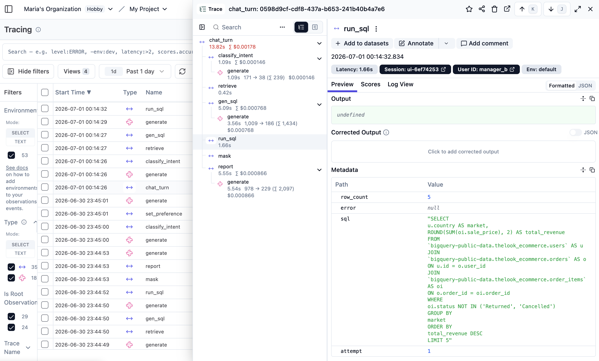

# Retail Data Assistant

Setup and run instructions. For the system design, technology choices, and how
each assignment requirement is handled, see
[`docs/ARCHITECTURE.md`](docs/ARCHITECTURE.md).

---

## Screenshots

**Conversation (Streamlit) — an analysis answer rendered for Manager A, whose
remembered preference is tabular output (per-user Learning Loop)**



**Observability — one turn as a Langfuse trace with a span per graph node, the
SQL of each attempt, prompts/outputs and token usage**



---

## Prerequisites

- **Python 3.11+** (developed on 3.14)
- A **Google Cloud project with billing enabled** and the BigQuery API on
  (the public `thelook_ecommerce` dataset is free to query; billing must exist
  to run jobs). 1 TB/month of query is free.
- A **Gemini API key** whose project has billing enabled
  ([AI Studio](https://aistudio.google.com/apikey)).
- *(Optional)* a free [Langfuse](https://cloud.langfuse.com) account for tracing.

---

## Setup

```bash
# 1. Clone and enter
cd opsfleet

# 2. Virtual environment
python3 -m venv venv
source venv/bin/activate          # Windows: venv\Scripts\activate

# 3. Dependencies
pip install -r requirements.txt

# 4. Configure environment
cp .env.example .env
#    then edit .env (see below)
```

### BigQuery authentication

Easiest path (used in development) — a **service account key**:

1. GCP Console → *IAM & Admin → Service Accounts → Create*.
2. Grant roles **BigQuery Data Viewer** and **BigQuery Job User**.
3. *Keys → Add key → JSON*, download it into the project as
   `service_account.json`.
4. Point `GOOGLE_APPLICATION_CREDENTIALS` at it in `.env`.

(If you already use `gcloud`, `gcloud auth application-default login` works too.)

### `.env`

```ini
GOOGLE_API_KEY=...                 # Gemini key (billing-enabled project)
GCP_PROJECT_ID=your-project-id
GOOGLE_APPLICATION_CREDENTIALS=/absolute/path/to/service_account.json

# optional — tracing turns on automatically when these are present
LANGFUSE_PUBLIC_KEY=
LANGFUSE_SECRET_KEY=
LANGFUSE_HOST=https://cloud.langfuse.com
```

### Seed the Golden Bucket

Embeds the historical Trios in `data/golden_trios.json` into a local ChromaDB:

```bash
python scripts/seed_golden_bucket.py
```

You should see `Seeded 5 trios into ChromaDB.` and a retrieval smoke test.
*(Optional sanity check of BigQuery: `python scripts/test_connection.py`.)*

---

## Run

### CLI (canonical interface)

```bash
python main.py --user manager_a
```

```
Retail Data Assistant (user: manager_a). Type 'exit' to quit.
Langfuse tracing: ON

you › Which product categories have the highest return rates?

  "Clothing Sets" Category Shows Significantly Higher Return Rates

  The "Clothing Sets" category stands out with a 13.9% return rate, notably
  higher than all other categories (next highest: "Suits" at 10.9%). Most
  categories cluster near 10%, suggesting a consistent baseline. …
  Recommendation: Investigate sizing accuracy and quality control for this line.

you › save that report
  Saved as report #1: "Clothing Sets High Return Rate".

you › delete all reports about clothing
  ⚠ This will permanently delete 1 report(s):
    #1 — Clothing Sets High Return Rate (2026-06-29)
  Proceed? (yes/no)
confirm › yes
  Deleted 1 report(s).

you › exit
```

The `--user` flag scopes saved reports and per-user preferences. The agent
remembers each manager's preferred report format (seeded **`manager_a` → tables**,
**`manager_b` → bullet points**), and a manager can change it in plain language
("from now on use bullet points") — the User-Level half of the Learning Loop.

### Streamlit UI (optional demo)

A thin visual layer over the **same** LangGraph agent — handy for live demos.
UI is not required by the assignment; the CLI is the graded interface.

```bash
streamlit run streamlit_app.py
```

---

## Project structure

```
src/
  config.py          env + tunables (cost cap, retry budget, paths)
  llm.py             Gemini client over REST (+ Langfuse generation spans)
  golden_bucket.py   ChromaDB retrieval of historical Trios (RAG)
  bigquery_tool.py   read-only SQL guard, cost cap, schema introspection
  pii.py             email/phone masking (rows + prose)
  reports.py         Saved Reports library (SQLite)
  preferences.py     per-user report-format memory (Learning Loop, user level)
  graph.py           the LangGraph agent: nodes, routing, confirmation gate
  observability.py   optional Langfuse tracing (no-op without keys)
data/golden_trios.json   5 investigative Trios (real thelook data)
scripts/                 seed_golden_bucket.py, test_connection.py
main.py                  CLI    streamlit_app.py  optional UI
persona.yaml             editable report tone (Agility requirement)
docs/ARCHITECTURE.md     HLD + detailed technical explanation
```

---

## Notes

- **Gemini is called over REST, not the gRPC SDK**, on purpose: gRPC name
  resolution failed in the development network. REST works wherever HTTPS does
  and gives us explicit retry/backoff control. See `src/llm.py`.
- **Costs:** queries are capped (`MAX_BYTES_BILLED`, default 2 GB) and use the
  BigQuery cache; the demo Trios scan a few MB each. LLM calls use
  `gemini-3.5-flash` by default (configurable via `GEMINI_MODEL`).
- **ChromaDB telemetry** prints a harmless upstream warning; it is silenced via
  `ANONYMIZED_TELEMETRY=false` set in `src/config.py`.
