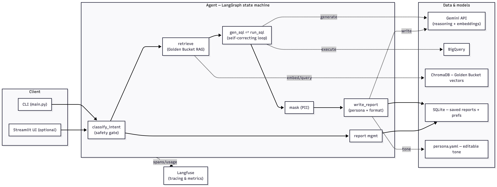
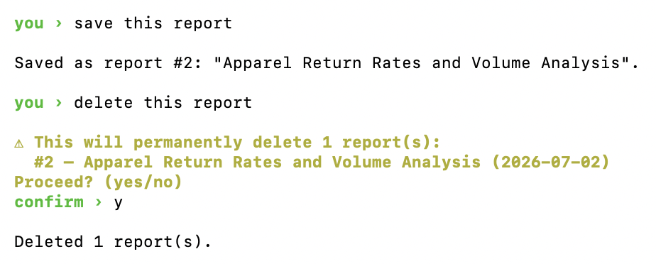

# High-Level Architecture

Hello! Below is the high level architecture description for the retail chat assistant 🙂

## Diagram

Some comments on the main flow of the diagram

1) Although the task asks for a simple CLI-based interface (which I also made) and clearly says that UI's won't gain any additional points, I also added Streamlit UI. I find it easier to debug the system using it, so it is also included in the final solution code just in case.
2) When a user input enters the system, firstly we analyse the intent – you can see how it's done in `src/graph.py`: it's either about analysis or some action with report or setting preferences. I believe it's not the most graceful decision: there should be separate deterministic interfaces for preferences and reports. It's better in terms of interface and token economy. But for a small prototype it's fine :)
3) If the user wants to analyse data, we form a query using examples from Golden Bucket – since it's a prototype I've only generated 5 of them but for production-ready product it's not enough. It requires more thorough analysis of the system to find out which examples to generate so that they cover most of the possible joins of the tables and main questions users usually ask
4) Then there's a self-correcting loop that generates an SQL and if the query returns an error it uses it to correct the SQL
5) Then there are some guardrails (`src/pii.py`) to exclude the sensitive data – twice, after the query is executed and after the report is generated
6) Then the report is written using persona.yaml (always read during report generation, never cached so you an update preferences on the go), also every user's preferences uploaded from SQLite database.
7) After that, the report can be saved to database

## Reasoning for the chosen Cloud services / LLM models/frameworks used

I use **Langgraph** as an agent framework because it is considered a good practice, and, overall, I just like it – it produces very readable code. Also it's a preferred framework in the task description. Since the system is a state machine, it's easy to represent it as a graph

I use the **Gemini 3.5 Flash** model everywhere because it's good enough for a prototype. Although I believe in writing a report we can use a bigger model like **Pro** – but it's just a hypothesis that needs to be tested. Also, using Gemini models was one of the requirements
I also used **gemini-embedding-001** for embeddings

**ChromaDB** is used to store the vectors, because it implements HNSW – this allows for fast vector search. While we only have 5 example trios it's not critical, but since there should ideally be more of them, in a real production project this would be a useful feature. You can also use pgvector or Pinecone in production-ready product

As a main database I use **SQLite**: to store reports, users info etc. It's the simplest thing that correctly models the access pattern (relational, transactional), but in production it can be replaced by Postgres for example

**BigQuery** database deliberately stays read-only for safety reasons: we know there are only tables the bot may have access to.

## Error handling and fallback strategies

**Malformed / wrong SQL** - as I said earlier, the system generates an SQL and if it returns an error, it self-corrects

**Empty result –** we ask the user to broaden the question ([https://github.com/mmashaaa/retail_test_task/blob/main/src/graph.py#L229](https://github.com/mmashaaa/retail_test_task/blob/main/src/graph.py#L229)). Now it's hardcoded, but if in production we want users to ask questions in different languages it should be generated given the previous context of the conversation

**LLM error –** if there's an error on LLM side we wait for a couple of seconds and send the request again, 5 times max ([https://github.com/mmashaaa/retail_test_task/blob/main/src/llm.py#L42](https://github.com/mmashaaa/retail_test_task/blob/main/src/llm.py#L42)). In production there should also be a fallback to a different LLM provider

The setup is described in README.md

## Make sure to include a detailed explanation of how you handle/solve each of the requirements

1) **Hybrid Intelligence:** as stated in the task, we use RAG to build a correct query and give examples of correct tables join. We take the top-3 closest trios now. Please note that I only generated 5 trios which, I believe, in not enough for the final production-ready solution
2) **Safety & PII Masking** – this one I explain in the comments for the diagram: two checks, after the query generation and after the report generation, checking that no emails of phones are in the report. Masking is deterministic via regex and direct check of the columns retrieved which is safer than LLM-based guardails

   Another thought on safety: the task states that the users are Store and Regional Managers. From that I can deduce that the Store Manager should only have access to their store information, and the Regional manager should have wider access. Although, the Store manager may have access to some statistical information about the region data/all the data without the details. There should be an ACL for this which is not implemented mow
3) **High-Stakes Oversight (Destructive Ops)** – we require an additional confirmation if we classify the user intent as to delete the report. This is how it looks in CLI:

   
4) **Continuous Improvement (The Learning Loop):** – user preferences are now stored in a separate table in SQLite and added into prompt when building a report ([https://github.com/mmashaaa/retail_test_task/blob/main/src/preferences.py#L33](https://github.com/mmashaaa/retail_test_task/blob/main/src/preferences.py#L33)) We now only store preferable report format but there's huge room for improvement here: I would implement something like memory.md in modern models and constantly update information about the user
5) **Resilience & Graceful Error Handling:** explained earlier in "Error handling and fallback strategies"
6) **Quality Assurance:** I've covered some deterministic logic with tests (sql guards, reports retrieval) although for production level it's not enough – there should be tests of overall system performance, e.g. evaluation set with golden questions/answers, and LLM-as-a-judge scoring of reports.
7) **Observability:** I use Langfuse for tracing – although production-ready system should have monitorings for token usage/errors/tool calling for every user/conversation, latency monitoring, and alerts for different sorts of anomalies
8) **Agility (Persona Management):** right now, you can edit persona.yaml, and, as I stated earlier, it will be read every report generation and used in report generation. Later some sort of UI can be added over it so non-technical users can edit it easily
